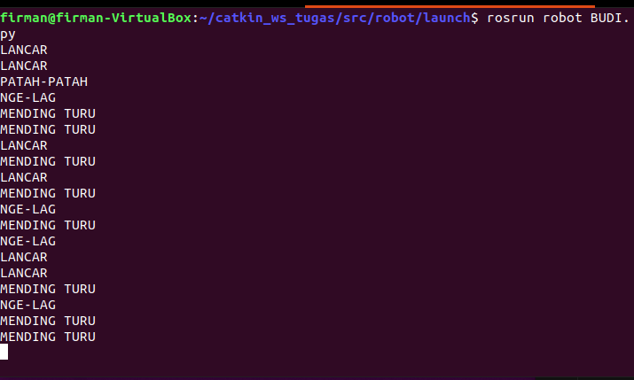

    <h1>【 Project Based ROS NOETIC 】</h1>
    <h3></h3>

  
 Description 

Di Negera Singanesia, hanya terdapat 2 provider untuk mengirimkan data dimana masing - masing provider mengirimkan sebuah data sebagai berikut:
- Provider SmartGuys mengirimkan data std_msgs/String Message dengan tiga kemungkinan saja  (“LOW”, “MEDIUM”, “HIGH”) https://docs.ros.org/en/api/std_msgs/html/msg/String.html
- Provider XS mengirimkan data std_msgs/Int16 Message dengan nilai antara (0 - 100) https://docs.ros.org/en/api/std_msgs/html/msg/Int16.html

Disaat 2 provider tersebut mengirimkan sebuah data, ada sebuah pengguna bernama Budi yang ingin mengonsumsi data tersebut untuk perangkatnya. Disaat menerima data tersebut ada beberapa kondisi:
- Jika Provider SmartGuys mengirim data “HIGH” dan provider XS mengirim data dengan nilai > 50 maka Budi akan menampilkan “LANCAR”
- Jika Provider SmartGuys mengirim data “MEDIUM” dan provider XS mengirim data dengan nilai > 50 maka Budi akan menampilkan “PATAH-PATAH”
- Jika Provider SmartGuys mengirim data “LOW” dan provider XS mengirim data dengan nilai > 50 maka Budi akan menampilkan “NGE-LAG”
- Kondisi lainnya akan menampilkan Budi akan menampilkan “MENDING TURU”

  
 Setup 

- Make sure you have ROS Noetic installed and configured properly.
- Navigate to the directory containing the ROS nodes.
- Build the ROS package using 'catkin_make'.
- Run the ROS nodes using 'rosrun' command.

**Output Image**

